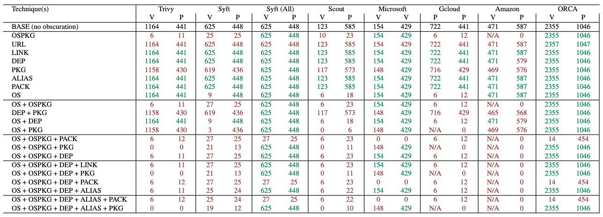

# Container obfuscation benchmark

This repository contains a dataset of container obfuscation techniques applied to the base `python:3.10` container.  
The goal of this benchmark is to evaluate the impact of various obfuscation methods on container security and vulnerability analysis.

## Run

```sh
python main.py
```

This command generates the corresponding Dockerfiles, with increasing obfuscation.  

## Tests

The following table compares the detection capabilities of various tools across different obfuscation techniques. V and P mean vulnerabilities and packages respectively. If an obfuscation (or multiple) technique reduces the amount of vulnerabiligies or packages detected then it is marked in ❌. Alternatively ✅ indicates that the tool is resilient to the technique. 

The ORCA tool can be found [here](https://github.com/kube-security/orca).

